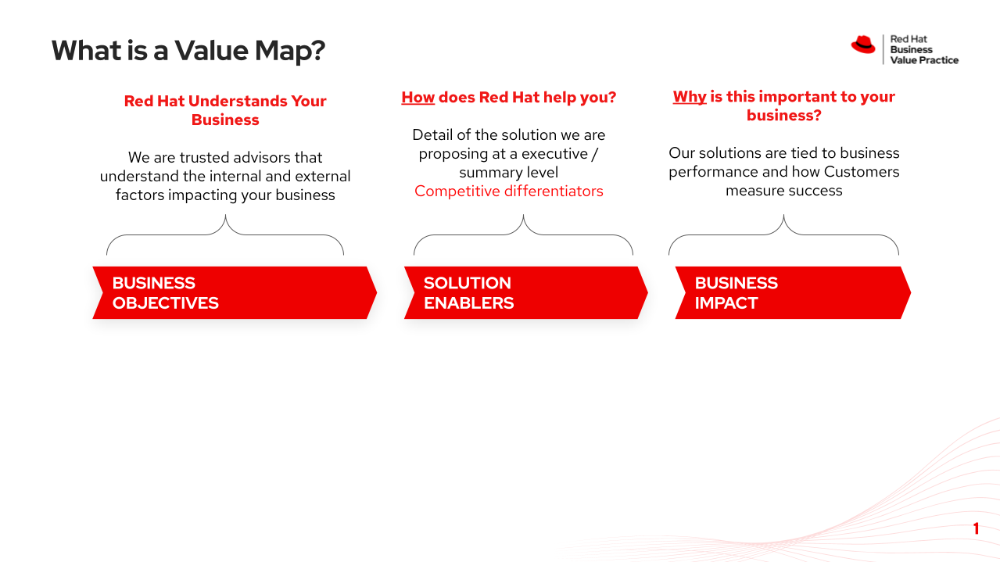
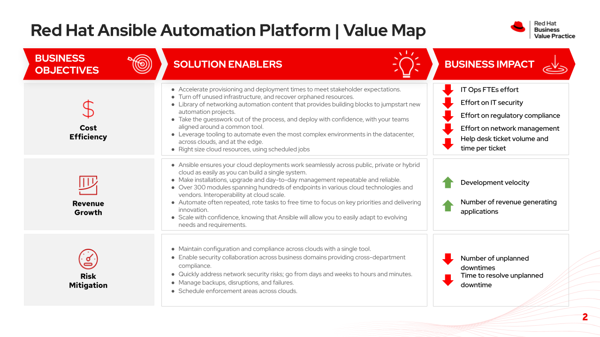
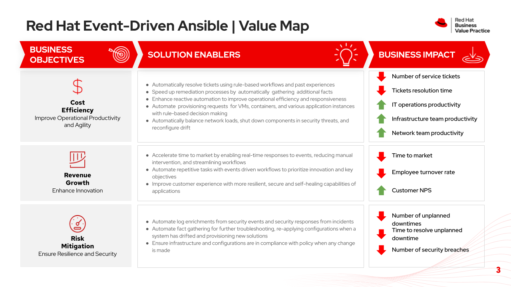
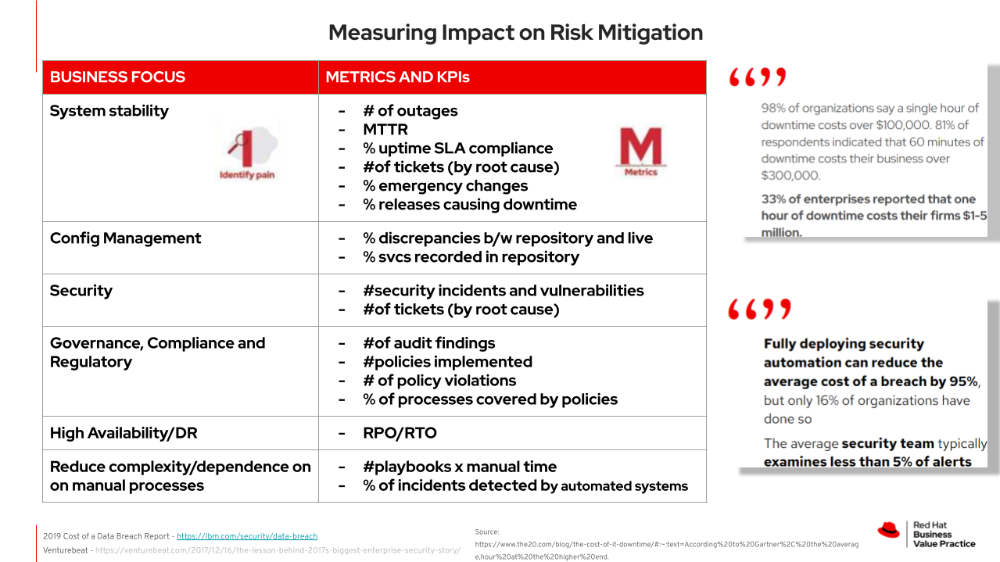
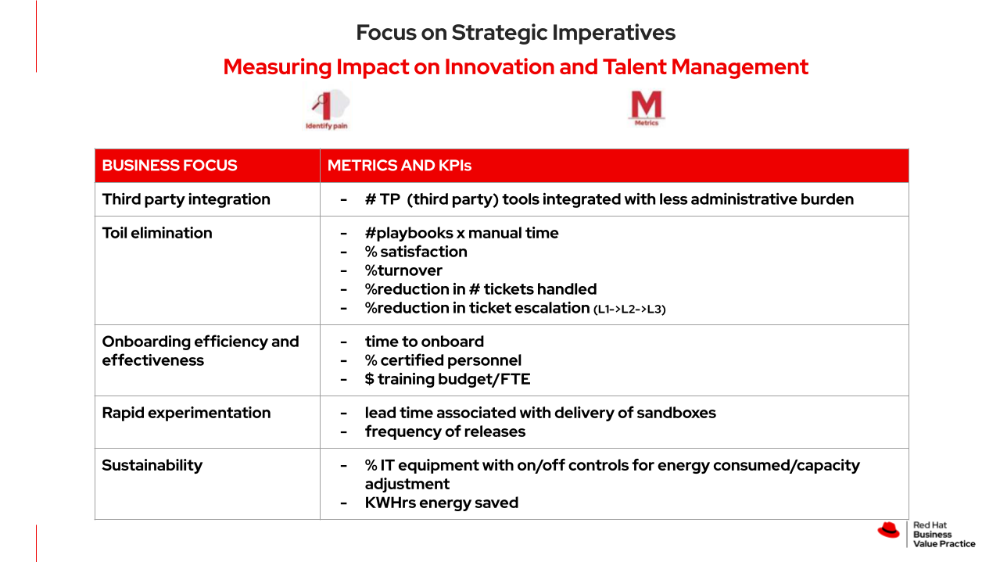
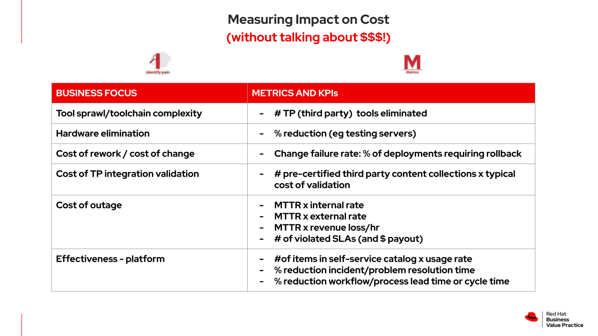
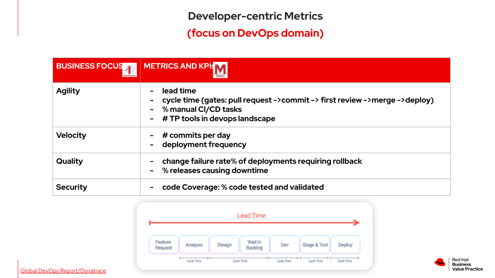
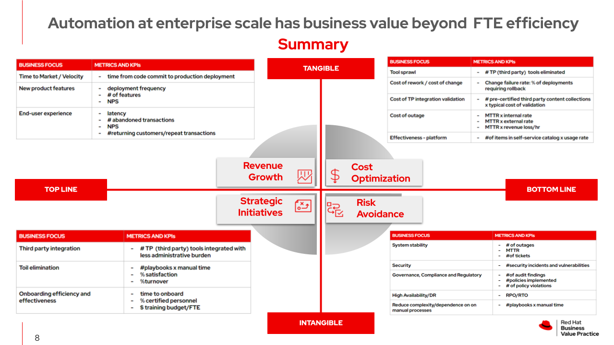

# Community of Practice Resources

### Typically the resources here are artifact examples of something that a CoP should produce. You may use these as a guide to populate similar arfifacts as you build your own internal Automation Community of Practice.

* [Red Hat Community of Practice - Automation Good Practices](https://redhat-cop.github.io/automation-good-practices/)

# Business Value and ROI

### This is a hot topic and widely debated but minimally understood. Here are some examples of where you will find value with Red Hat Ansible Automation Platform. Included are common business outcome metrics, KPIs, and related categories of where value is derived. These resources, prepared by Red Hat's Business Value Practice, are intended to serve as an example of where we see customers getting value from their automation investment(s). This is intended to be used as a good starting point to understand where to look for value, what makes a good metric, and guides for baselining and tracking automation value over time.

